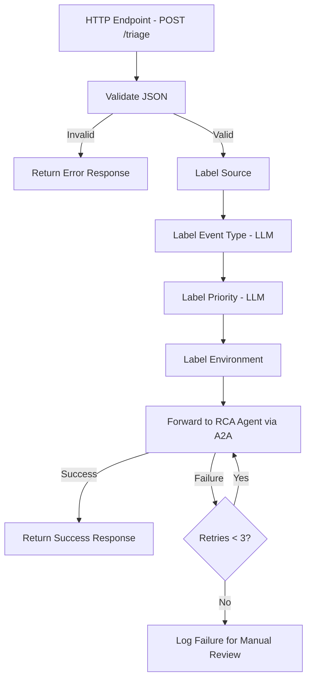

# Design Document: Alert Triage Agent

## Overview

The Alert Triage Agent is a LangGraph-based AI agent that serves as a single ingestion point for operational alerts from AWS services (CloudWatch, SNS, EventBridge). It receives JSON-formatted alert messages via an HTTP endpoint, enriches them with structured labels (source, event type, priority, environment), and forwards the enriched messages to a downstream Root Cause Analysis (RCA) agent using the A2A (Agent-to-Agent) protocol.

The agent is built in Python using the LangGraph framework for orchestrating the triage workflow as a directed graph of processing nodes. It uses a configurable LLM to classify event type and priority. The system is containerized via Docker and deployable to Kubernetes using a KAgent template.

### Key Design Decisions

- **LangGraph as orchestration framework**: The triage pipeline is modeled as a LangGraph `StateGraph` where each labeling step is a node. This gives us clear separation of concerns, easy extensibility, and built-in state management.
- **Deterministic labeling where possible**: Source name and environment labels are extracted deterministically from message structure. Only event type and priority classification use the LLM, minimizing cost and latency.
- **A2A protocol for agent communication**: The enriched message is forwarded to the RCA agent using the A2A (Agent-to-Agent) protocol. The agent exposes an A2A-compliant endpoint and sends tasks to the RCA agent's A2A endpoint, enabling standardized agent interoperability. The A2A protocol wraps the enriched alert as a `Task` with `Message` parts, allowing the RCA agent to process it within the A2A task lifecycle.
- **Configuration via environment variables**: LLM provider/model and RCA agent URL are configured through environment variables, with sensible defaults for the LLM.
- **Multi-source system prompt loading**: The system prompt can be loaded from an HTTP URL, a file path (including Kubernetes ConfigMap mounts), or the bundled default file. Sources are tried in priority order with automatic fallback, enabling centralized prompt management in production while keeping local development simple.

## Architecture

The agent follows a pipeline architecture modeled as a LangGraph `StateGraph`:



### LangGraph State Flow

Each node in the graph reads from and writes to a shared `TriageState` TypedDict. The graph executes sequentially:

1. **`validate`** — Validates incoming JSON, rejects malformed input
2. **`label_source`** — Determines source system from message structure
3. **`label_event_type`** — Uses LLM to classify as "alert" or "notification"
4. **`label_priority`** — Uses LLM to assign P1/P2/P3
5. **`label_environment`** — Extracts environment from message fields or AWS account ID
6. **`forward_to_rca`** — Sends enriched message to RCA agent via A2A protocol with retry logic

## Components and Interfaces

### 1. HTTP Server (`server.py`)

Exposes a single POST endpoint to receive alert messages.

- **Framework**: FastAPI
- **Endpoint**: `POST /triage`
- **Request body**: Raw JSON alert message
- **Response**: JSON with triage result or error details
- Validates `RCA_AGENT_URL` and LLM configuration at startup; fails fast with descriptive error if missing or invalid.

### 2. LangGraph Workflow (`graph.py`)

Defines the `StateGraph` with all triage nodes.

```python
from langgraph.graph import StateGraph, END

def build_triage_graph(llm, rca_url: str) -> StateGraph:
    graph = StateGraph(TriageState)
    graph.add_node("validate", validate_node)
    graph.add_node("label_source", label_source_node)
    graph.add_node("label_event_type", label_event_type_node)
    graph.add_node("label_priority", label_priority_node)
    graph.add_node("label_environment", label_environment_node)
    graph.add_node("forward_to_rca", forward_to_rca_node)
    # Edges
    graph.set_entry_point("validate")
    graph.add_conditional_edges("validate", route_validation)
    graph.add_edge("label_source", "label_event_type")
    graph.add_edge("label_event_type", "label_priority")
    graph.add_edge("label_priority", "label_environment")
    graph.add_edge("label_environment", "forward_to_rca")
    graph.add_edge("forward_to_rca", END)
    return graph.compile()
```

### 3. Node Functions (`nodes/`)

Each node is a pure function that takes `TriageState` and returns a partial state update.

- **`validate_node`**: Checks JSON validity, sets `is_valid` flag
- **`label_source_node`**: Pattern-matches message structure to determine source (CW, SNS, EventBridge, UNKNOWN)
- **`label_event_type_node`**: Invokes LLM with system prompt to classify event type
- **`label_priority_node`**: Invokes LLM with system prompt to assign priority
- **`label_environment_node`**: Extracts environment from message fields, falls back to AWS account ID, then UNKNOWN
- **`forward_to_rca_node`**: Sends enriched message to RCA agent via A2A protocol with retry logic

### 4. Source Detection (`labelers/source.py`)

Deterministic source detection based on known message structures:

| Source       | Detection Criteria                                                        |
|-------------|---------------------------------------------------------------------------|
| CloudWatch  | `AlarmName` + `NewStateValue` fields, or `source == "aws.cloudwatch"`     |
| SNS         | `Type == "Notification"` + `TopicArn` field present                       |
| EventBridge | `source` + `detail-type` + `detail` fields in EventBridge schema          |
| UNKNOWN     | No pattern matched                                                        |

### 5. Environment Extraction (`labelers/environment.py`)

Hierarchical extraction with fallback chain:
1. Check for explicit `environment`, `env`, or `environment_id` fields in the message (including nested)
2. Extract AWS account ID from ARN fields (`TopicArn`, `Source`, `account` in EventBridge `detail`)
3. Fall back to `"UNKNOWN"`

### 6. LLM Integration (`llm.py`)

- Wraps LLM client initialization using LangChain's `ChatOpenAI` or equivalent
- Reads `LLM_PROVIDER`, `LLM_MODEL`, and `LLM_API_KEY` from environment variables
- Defaults to a sensible model if not configured
- Validates configuration at startup; fails fast with descriptive error on invalid config

### 7. A2A Forwarder (`forwarder.py`)

Handles communication with the RCA agent using the A2A (Agent-to-Agent) protocol:

- Wraps the enriched alert message as an A2A `Task` containing a `Message` with a JSON `Part`
- Sends the task to the RCA agent's A2A endpoint (`POST {RCA_AGENT_URL}/tasks/send`) via HTTP
- Retry logic: up to 3 retries with exponential backoff on error responses
- Logs errors on each failed attempt
- Logs full enriched message on final failure for manual review

```python
def build_a2a_task(enriched_message: dict) -> dict:
    """Wrap enriched alert as an A2A Task."""
    return {
        "jsonrpc": "2.0",
        "method": "tasks/send",
        "params": {
            "id": generate_task_id(),
            "message": {
                "role": "user",
                "parts": [
                    {
                        "type": "data",
                        "data": enriched_message
                    }
                ]
            }
        }
    }
```

### 8. Configuration (`config.py`)

Reads and validates all configuration from environment variables:
- `LLM_PROVIDER` (optional, default: `"openai"`)
- `LLM_MODEL` (optional, default: `"gpt-4o-mini"`)
- `LLM_API_KEY` (required if using external provider)
- `RCA_AGENT_URL` (required — agent fails to start without it)
- `SERVICE_PORT` (optional, default: `8080`)
- `SYSTEM_PROMPT_URL` (optional — HTTP(S) URL to fetch the system prompt from)
- `SYSTEM_PROMPT_FILE` (optional — file path to load the system prompt from, e.g., a ConfigMap-mounted path)

Startup validation:
- If `RCA_AGENT_URL` is missing, the agent logs a descriptive error and exits.
- If LLM configuration is invalid (e.g., unsupported provider), the agent logs a descriptive error and exits.
- If all system prompt sources fail to load, the agent logs a descriptive error listing each attempted source and its failure reason, then exits.

### 9. System Prompt Loader (`prompt_loader.py`)

Loads the system prompt from multiple sources with a defined fallback chain. The loader tries each configured source in priority order and returns the first successfully loaded prompt.

**Fallback priority order:**
1. **HTTP URL** (`SYSTEM_PROMPT_URL`) — Fetches the prompt from a remote HTTP(S) endpoint at startup. Useful for centralized prompt management.
2. **File path / ConfigMap** (`SYSTEM_PROMPT_FILE`) — Reads the prompt from a local file path. In Kubernetes, this is typically a ConfigMap mounted as a volume (e.g., `/etc/config/system_prompt.txt`).
3. **Default local file** (`prompts/system_prompt.txt`) — The bundled default prompt shipped with the project.

```python
import os
import httpx
from pathlib import Path

class PromptLoadError(Exception):
    """Raised when all prompt sources fail to load."""
    pass

def load_system_prompt() -> str:
    """Load system prompt using fallback chain: URL → file → default."""
    errors: list[str] = []

    # 1. Try HTTP URL
    url = os.getenv("SYSTEM_PROMPT_URL")
    if url:
        try:
            resp = httpx.get(url, timeout=10)
            resp.raise_for_status()
            return resp.text
        except Exception as e:
            errors.append(f"HTTP URL ({url}): {e}")

    # 2. Try file path (ConfigMap or custom file)
    file_path = os.getenv("SYSTEM_PROMPT_FILE")
    if file_path:
        try:
            return Path(file_path).read_text()
        except Exception as e:
            errors.append(f"File path ({file_path}): {e}")

    # 3. Try default local file
    default_path = Path("prompts/system_prompt.txt")
    try:
        return default_path.read_text()
    except Exception as e:
        errors.append(f"Default file ({default_path}): {e}")

    raise PromptLoadError(
        "Failed to load system prompt from all sources:\n"
        + "\n".join(f"  - {err}" for err in errors)
    )
```

The loaded prompt is injected into LLM calls for event type and priority classification.

### 10. Dockerfile

- Base image: `python:3.12-slim`
- Installs dependencies from `requirements.txt`
- Exposes service port (default 8080)
- Runs the agent via `uvicorn`

### 11. KAgent Kubernetes Template (`k8s/kagent.yaml`)

- Deployment resource with configurable replicas
- Service resource exposing the agent port
- Environment variables injected via ConfigMap (LLM settings, RCA agent URL, `SYSTEM_PROMPT_URL`, `SYSTEM_PROMPT_FILE`)
- Optional volume mount for a ConfigMap containing the system prompt file (mounted at a path referenced by `SYSTEM_PROMPT_FILE`)
- Resource requests and limits defined for the container

## Data Models

### TriageState (LangGraph State)

```python
from typing import TypedDict, Optional, Literal

class Labels(TypedDict, total=False):
    source: Literal["CW", "SNS", "EventBridge", "UNKNOWN"]
    event_type: Literal["alert", "notification"]
    priority: Literal["P1", "P2", "P3"]
    environment: str

class TriageState(TypedDict, total=False):
    raw_message: dict              # Original JSON message
    is_valid: bool                 # Whether JSON validation passed
    error: Optional[str]           # Error message if validation failed
    labels: Labels                 # Accumulated labels
    forwarded: bool                # Whether successfully forwarded to RCA
    forward_error: Optional[str]   # Error from forwarding attempts
    retry_count: int               # Number of forwarding retries attempted
```

### Enriched Alert Message (Output to RCA Agent)

```json
{
  "original_message": { ... },
  "labels": {
    "source": "CW",
    "event_type": "alert",
    "priority": "P1",
    "environment": "production"
  },
  "timestamp": "2025-01-15T10:30:00Z",
  "agent_version": "1.0.0"
}
```

### A2A Task Envelope

The enriched message is wrapped in an A2A task for transmission to the RCA agent:

```json
{
  "jsonrpc": "2.0",
  "method": "tasks/send",
  "params": {
    "id": "unique-task-id",
    "message": {
      "role": "user",
      "parts": [
        {
          "type": "data",
          "data": {
            "original_message": { ... },
            "labels": { ... },
            "timestamp": "2025-01-15T10:30:00Z",
            "agent_version": "1.0.0"
          }
        }
      ]
    }
  }
}
```

### Configuration Model

```python
from typing import Optional
from pydantic import BaseModel, Field

class AgentConfig(BaseModel):
    llm_provider: str = "openai"
    llm_model: str = "gpt-4o-mini"
    llm_api_key: str = ""
    rca_agent_url: str
    service_port: int = Field(default=8080, ge=1, le=65535)
    system_prompt_url: Optional[str] = None
    system_prompt_file: Optional[str] = None
```

## Correctness Properties

*A property is a characteristic or behavior that should hold true across all valid executions of a system — essentially, a formal statement about what the system should do. Properties serve as the bridge between human-readable specifications and machine-verifiable correctness guarantees.*

### Property 1: Valid JSON acceptance

*For any* valid JSON object, submitting it to the triage endpoint should result in the message being accepted for processing (no validation error returned).

**Validates: Requirements 1.1, 1.3**

### Property 2: Invalid JSON rejection

*For any* string that is not valid JSON, submitting it to the triage endpoint should result in a rejection with a descriptive error response, and no labels should be produced.

**Validates: Requirements 1.2**

### Property 3: Source label correctness

*For any* valid alert message, the `label_source` function should assign the correct source label: "CW" for CloudWatch-structured messages, "SNS" for SNS-structured messages, "EventBridge" for EventBridge-structured messages, and "UNKNOWN" for messages matching no known pattern.

**Validates: Requirements 2.1, 2.2, 2.3, 2.4**

### Property 4: Event type label validity

*For any* valid alert message that passes through the event type labeling node, the resulting `event_type` label should be exactly one of "alert" or "notification".

**Validates: Requirements 3.1**

### Property 5: Priority label validity

*For any* valid alert message that passes through the priority labeling node, the resulting `priority` label should be exactly one of "P1", "P2", or "P3".

**Validates: Requirements 4.1**

### Property 6: Environment label hierarchical extraction

*For any* valid alert message, the environment labeling function should: return the explicit environment name/ID if present in the message, otherwise return the AWS account ID extracted from ARN fields, otherwise return "UNKNOWN". The precedence order must always hold.

**Validates: Requirements 5.1, 5.2, 5.3**

### Property 7: Enriched message completeness

*For any* valid alert message that completes the triage pipeline, the enriched output should contain all four labels (source, event_type, priority, environment) and the original message, before being forwarded to the RCA agent.

**Validates: Requirements 6.1**

### Property 8: Retry on RCA agent failure

*For any* enriched message where the RCA agent returns an error response, the forwarder should retry the request up to exactly 3 times before giving up.

**Validates: Requirements 6.2**

### Property 9: Configuration application

*For any* valid combination of `LLM_PROVIDER` and `LLM_MODEL` environment variables, the agent should initialize with those values reflected in its LLM client configuration.

**Validates: Requirements 8.1**

### Property 10: Invalid configuration startup failure

*For any* invalid LLM configuration (unsupported provider, malformed model name) or missing `RCA_AGENT_URL`, the agent should fail to start and produce a descriptive error log message.

**Validates: Requirements 8.3, 9.2**

### Property 11: System prompt fallback chain priority

*For any* combination of prompt source configurations (HTTP URL, file path, default file) where at least one source is available, the prompt loader should return the content from the highest-priority available source: HTTP URL first, then file path / ConfigMap, then default local file. If a higher-priority source fails, the loader should fall through to the next source in the chain.

**Validates: Requirements 7.2, 7.3, 7.4, 7.5, 7.6, 7.7**

### Property 12: All prompt sources failure

*For any* configuration where all configured prompt sources fail to load (HTTP errors, file not found, missing default), the agent should fail to start and produce an error message that lists each attempted source and its specific failure reason.

**Validates: Requirements 7.8**

## Error Handling

### Input Validation Errors
- **Invalid JSON**: The `validate` node detects malformed JSON and short-circuits the pipeline, returning a 400 response with a descriptive error message. No labels are produced and no forwarding is attempted.
- **Unexpected message structure**: Messages that are valid JSON but don't match any known source pattern are still processed — they receive a `"UNKNOWN"` source label and continue through the pipeline.

### LLM Errors
- **LLM invocation failure**: If the LLM call fails during event type or priority labeling (timeout, rate limit, API error), the node raises an exception that is caught by the graph runner. The error is logged and a 500 response is returned to the caller.
- **LLM invalid output**: If the LLM returns a value outside the expected set (e.g., not "alert"/"notification" or not "P1"/"P2"/"P3"), the node should reject the output, log a warning, and retry the LLM call once. If the retry also produces invalid output, the node raises an error.

### Forwarding Errors
- **RCA agent unreachable or error response**: The forwarder retries up to 3 times with exponential backoff (e.g., 1s, 2s, 4s delays). Each failed attempt is logged with the error details.
- **All retries exhausted**: The full enriched message is logged at ERROR level for manual review. The triage endpoint returns a response indicating partial success (labels were applied but forwarding failed).

### Configuration Errors
- **Missing `RCA_AGENT_URL`**: The agent fails to start and logs: `"RCA_AGENT_URL is required but not configured."`
- **Invalid LLM configuration**: The agent fails to start and logs a descriptive error identifying the invalid configuration values.
- **Missing optional config**: If `LLM_PROVIDER` or `LLM_MODEL` are not set, defaults are used silently.

### System Prompt Loading Errors
- **HTTP URL failure**: If `SYSTEM_PROMPT_URL` is configured but the fetch fails (network error, non-200 response, timeout), the error is logged at WARNING level and the loader falls through to the file path source.
- **File path failure**: If `SYSTEM_PROMPT_FILE` is configured but the file cannot be read (not found, permission denied), the error is logged at WARNING level and the loader falls through to the default local file.
- **Default file failure**: If the default `prompts/system_prompt.txt` cannot be read, the error is logged.
- **All sources exhausted**: If all prompt sources fail, the agent fails to start and logs an ERROR message listing each attempted source and its specific failure reason.

## Testing Strategy

### Unit Tests

Unit tests cover specific examples, edge cases, and integration points:

- **JSON validation**: Test with specific valid and invalid JSON payloads
- **Source detection**: Test with representative CloudWatch, SNS, EventBridge, and unrecognized message samples
- **Environment extraction**: Test with messages containing `environment` field, messages with only ARN fields, and messages with neither
- **LLM output parsing**: Test that valid and invalid LLM responses are handled correctly
- **A2A task construction**: Test that the enriched message is correctly wrapped in the A2A task envelope
- **Configuration loading**: Test default values, valid overrides, missing required values, and invalid values
- **Retry logic**: Test that retries occur on failure and stop after 3 attempts
- **System prompt loading**: Test loading from HTTP URL, file path, and default file individually; test fallback when a source fails; test error when all sources fail

### Property-Based Tests

Property-based tests verify universal properties across randomly generated inputs. Use the `hypothesis` library for Python.

Each property test must:
- Run a minimum of 100 iterations
- Reference its design document property in a tag comment
- Use custom `hypothesis` strategies to generate realistic alert messages

**Test tags follow this format:**
```
# Feature: alert-triage-agent, Property {number}: {property_text}
```

**Property test mapping:**

| Property | Test Description |
|----------|-----------------|
| Property 1 | Generate random valid JSON dicts, verify acceptance |
| Property 2 | Generate random non-JSON strings, verify rejection with error |
| Property 3 | Generate random messages per source pattern, verify correct label |
| Property 4 | Generate random messages, verify event_type is "alert" or "notification" |
| Property 5 | Generate random messages, verify priority is "P1", "P2", or "P3" |
| Property 6 | Generate messages with/without env fields and ARNs, verify fallback chain |
| Property 7 | Generate random valid messages, verify all 4 labels present in output |
| Property 8 | Simulate RCA failures, verify exactly up to 3 retries |
| Property 9 | Generate valid config combinations, verify agent initializes with them |
| Property 10 | Generate invalid configs, verify startup failure with error log |
| Property 11 | Generate random combinations of available/failing prompt sources, verify highest-priority available source is used |
| Property 12 | Generate random failure reasons for all prompt sources, verify startup failure with all reasons listed |

### Custom Hypothesis Strategies

Define reusable strategies for generating test data:
- `cloudwatch_message()` — generates messages with `AlarmName`, `NewStateValue`, and optional fields
- `sns_message()` — generates messages with `Type: "Notification"` and `TopicArn`
- `eventbridge_message()` — generates messages with `source`, `detail-type`, and `detail`
- `unknown_message()` — generates valid JSON that doesn't match any known pattern
- `alert_message()` — composite strategy drawing from all source types
- `invalid_json_string()` — generates strings that are not valid JSON
- `prompt_source_config()` — generates random combinations of prompt source availability (URL present/absent/failing, file present/absent/failing, default present/absent) for testing the fallback chain
